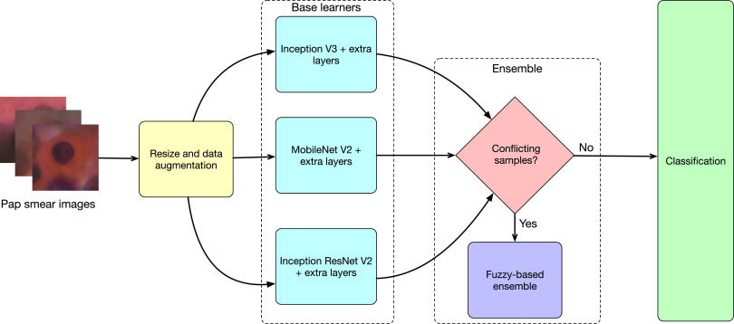

[](https://github.com/rishavpramanik/CervicalFuzzyDistanceEnsemble/actions/workflows/CodeQL.yml)
# Cervical cancer detection from Pap Smear Images
"A Fuzzy Distance-based Ensemble of Deep Models for Cervical Cancer Detection" published in in Computer Methods and Programs in Biomedicine, Elsevier

**A Fuzzy Distance-based Ensemble of Deep Models for Cervical Cancer Detection:**

Find the original paper [here](https://www.sciencedirect.com/science/article/pii/S0169260722001626).
<p align="center">
  
</p>


# Datasets Links
1. [SIPaKMeD SCI Pap Smear Images](https://www.cs.uoi.gr/~marina/sipakmed.html)
2. [Herlev](http://mde-lab.aegean.gr/index.php/downloads)
3. [Mendeley LBC](https://data.mendeley.com/datasets/zddtpgzv63/4)
# Instructions to run the code
Required directory structure:

(Note: ``train`` and ``val`` contains subfolders representing classes in the dataset.)

```

+-- data
|   +-- .
|   +-- train
|   |   +--class A
|   |   +--class B
|   |   ...
|   +-- val
|   |   +--class A
|   |   +--class B
|   |   ...
+-- main.py

```

- 
1. Download the repository and install the required packages:
```pip3 install -r requirements.txt```
2. The main file is sufficient to run the experiments.
Then, run the code using linux terminal as follows:

```python3 main.py --data_directory "data"```

Available arguments:
- `--num_epochs`: Number of epochs of training. Default = 70
- `--learning_rate`: Learning Rate. Default = 0.0001
- `--batch_size`: Batch Size. Default = 16
- `--path`: Data Path. Default= './'
- `--kfold`: K-Fold, to perform K fold cross validation. Default= 5

3. Please don't forget to edit the above parameters before you start
## Citation:
```
@article{pramanik2022fuzzy,
  title={A Fuzzy Distance-based Ensemble of Deep Models for Cervical Cancer Detection},
  author={Pramanik, Rishav and Biswas, Momojit and Sen, Shibaprasad and de Souza J{\'u}nior, Luis Antonio and Papa, Jo{\~a}o Paulo and Sarkar, Ram},
  journal={Computer Methods and Programs in Biomedicine},
  doi= {10.1016/j.cmpb.2022.106776},
  pages={106776},
  year={2022},
  publisher={Elsevier}
}
```
